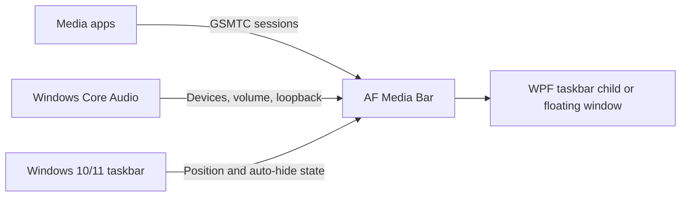

# AF Media Bar

<div align="center">

  <a href="https://github.com/Fervent-Tempo/AF-Media-Bar/releases">
    
  </a>
  <a href="https://github.com/Fervent-Tempo/AF-Media-Bar/releases">
    
  </a>
  <a href="https://github.com/Fervent-Tempo/AF-Media-Bar/stargazers">
    
  </a>
  <a href="https://github.com/Fervent-Tempo/AF-Media-Bar/issues">
    
  </a>
  <a href="LICENSE">
    
  </a>

  <br><br>

  

  <h1>AF Media Bar</h1>

  <p>Media controls, audio device switching, and lightweight system metrics on the Windows 10/11 taskbar.</p>

  <p>
    <a href="README.md">简体中文</a>
    ·
    English
    <br>
    <a href="#installation">Quick start</a>
    ·
    <a href="https://github.com/Fervent-Tempo/AF-Media-Bar/issues/new?template=bug_report.yml">Report a bug</a>
    ·
    <a href="https://github.com/Fervent-Tempo/AF-Media-Bar/issues/new?template=feature_request.yml">Request a feature</a>
  </p>

</div>

## Demo

### In Action

<div align="center">


</div>

### Introduction Video

- [Watch the AF Media Bar introduction video on Bilibili](https://www.bilibili.com/video/BV1Bjuq6bErr)

## Table of Contents
<div align="center">

- [Demo](#demo)
- [Overview](#overview)
- [Features](#features)
- [How It Works](#how-it-works)
- [Installation](#installation)
- [Basic Usage](#basic-usage)
- [Updating and Uninstalling](#updating-and-uninstalling)
- [Troubleshooting](#troubleshooting)
- [Technical Limitations](#technical-limitations)
- [Privacy and Security](#privacy-and-security)
- [Building from Source](#building-from-source)
- [Project Structure](#project-structure)
- [TODO](#todo)
- [Contributing](#contributing)
- [License](#license)

</div>

## Overview

AF Media Bar is a portable media controller for Windows 10 and Windows 11. It reads Global System Media Transport Controls (GSMTC) sessions, displays artwork, title, and artist, and provides previous, play/pause, next, and source switching controls.

The app runs in its own process. Its WPF player can be hosted as a taskbar child window or used as a freely movable floating window. It does not modify or inject code into `explorer.exe`. Any player that publishes a GSMTC session can be discovered, including NetEase Cloud Music, QQ Music, Spotify, major browsers, VLC, PotPlayer, Windows Media Player, mpv, and foobar2000.

## Features

<div align="center">

| Category | Capabilities |
| --- | --- |
| Media | Artwork, title, artist, previous, play/pause, next, and multiple source selection |
| Source interaction | Return to the current media app and switch sessions with the mouse wheel |
| Taskbar behavior | Automatic horizontal/vertical detection, manual placement and locking, automatic avoidance, auto-hide and fullscreen handling |
| Window modes | Switch between a taskbar child and a floating window; both modes support horizontal/vertical layouts and 70%-125% display scaling |
| Auto-hide | Hide when every media session is stopped; floating windows support desktop-edge auto-collapse, an indicator line, and smooth animation |
| Audio devices | List and switch the default output device, including delayed wheel selection |
| App volume | Match the selected media process and adjust its Windows mixer volume in 2% steps |
| Visualizer | Nine-band spectrum from WASAPI loopback capture |
| Metrics | Optional system memory, CPU, GPU, and AF Media Bar process memory |
| Low-spec mode | Software rendering with transitions, marquees, and fades disabled |

</div>

## How It Works

<div align="center">



</div>

The Windows 10/11 media card is an internal Explorer/Shell surface rather than a supported embeddable control. AF Media Bar uses the public GSMTC API behind that card and renders its own interface, avoiding Explorer injection and its stability risks.

## Installation

### Requirements

- Windows 10 version 1809 (build 17763) or later, x64
- No separate .NET installation is required for the recommended self-contained package

### Recommended package

1. Open [Releases](https://github.com/Fervent-Tempo/AF-Media-Bar/releases).
2. Download `AFMediaBar-vX.Y.Z-win-x64.zip`. Do not download GitHub's automatically generated source archives.
3. Extract the package to get one self-contained `AFMediaBar.exe`; the archive no longer contains hundreds of .NET runtime files.
4. Place it in a permanent writable directory, such as `D:\AFMediaBar`, and run it.
5. Right-click the player or tray icon and choose “Open detailed settings...” to configure startup, components, layout, appearance, and interaction.

AF Media Bar is not commercially code-signed, so Windows SmartScreen may show an unknown publisher warning on first launch.

## Basic Usage
<div align="center">

| Action | Result |
| --- | --- |
| Hover over the bar | Expand media controls |
| Click previous / play / next | Execute the commands supported by the current media session |
| Click artwork or title | Return to the selected media app |
| Scroll over the media area | Switch between GSMTC sessions |
| Click the output device button | Open the render device list |
| Scroll over the device button | Preview a device and apply it after scrolling stops |
| Click the volume button | Open the selected media app volume slider |
| Scroll over the volume button | Change application volume in 2% steps |
| Drag the artwork/title area | Move an unlocked manually placed bar |
| Switch to floating mode | Place the player anywhere in the desktop work area |
| Drag a floating window to a desktop edge | Collapse it automatically when desktop-edge auto-collapse is enabled; move the pointer near the indicator line to reveal it |
| Right-click the bar or tray icon | Open detailed settings, media actions, or the exit menu |

</div>

Some players require “system media controls,” “media keys,” or “SMTC” to be enabled in their own settings.

## Updating and Uninstalling

### Updating

The app checks its version manifest shortly after startup, at most once per day. Automatic checks can be disabled under **Detailed settings → General → Get updates**. You can also check immediately and open any configured GitHub, Quark, Baidu, or Lanzou download channel there.

This version only retrieves update information and opens download links. It does not silently replace the running executable. To install an update:

1. Exit AF Media Bar from the tray menu.
2. Download and extract the new version.
3. Replace the old `AFMediaBar.exe` with the new one, then restart the app.

Position, display options, and startup settings are saved in the current user's registry. Replacing the program file will not remove them.

### Uninstalling

1. Disable startup from the context menu, then exit the app.
2. Delete the AF Media Bar program directory.
3. To remove settings as well, run this in PowerShell:

```powershell
reg.exe delete "HKCU\Software\AFMediaBar" /f
reg.exe delete "HKCU\Software\Microsoft\Windows\CurrentVersion\Run" /v "AF Media Bar" /f
```


## Troubleshooting

### No media session appears

Make sure the app is actively playing media and has system media controls enabled. Browsers normally create a session only while a tab is playing audio or video. If the session is still missing, the app may not be supported; please report it in an Issue.

### The bar overlaps taskbar icons

Manual placement is the default. Unlock the position, drag the bar to an empty area, and lock it again. Automatic avoidance may be affected by third-party taskbar tools or Windows updates.

### Output device switching fails

Device enumeration uses supported Windows APIs, but changing the default endpoint relies on the undocumented `PolicyConfig` COM interface. Windows updates, managed-device policies, or unusual drivers may block this operation without affecting media controls.

### Application volume is unavailable or targets the wrong process

Volume control matches the GSMTC source to Windows audio sessions. Browser process models, multiple streams in one process, and custom audio engines can make a unique match impossible.

### Resource usage is higher than expected

Disable unused metrics and the audio visualizer, or enable low-spec mode. The visualizer reads WASAPI loopback data every 50 ms while enabled.

## Technical Limitations

- The bar is a WPF window in an independent process. Taskbar mode attaches it to Explorer with `SetParent`, while floating mode uses an independent top-level window. It is not an Explorer plugin and does not inject code.
- The app must rediscover and reattach to the taskbar after Explorer restarts or third-party taskbar tools change its window structure; heavily customized environments may be incompatible.
- Output switching uses the undocumented Windows `PolicyConfig` interface and may change in future Windows releases.
- Automatic placement depends on Windows UI Automation and may not recognize customized taskbars.
- The current instance follows the primary monitor taskbar only.
- Browsers decide whether multiple tabs appear as one or multiple GSMTC sessions.
- Only a `win-x64` package is currently published; ARM64 is not yet available.

## Privacy and Security

- No telemetry, advertisements, accounts, or network analytics are included.
- Automatic update checks only request the public `latest.json` manifest and never upload media data, device information, or user settings; they can be disabled in settings.
- Media metadata, system metrics, and audio operations stay on the local machine.
- The app runs as the current user, does not request elevation, and does not inject into Explorer.
- Report security issues privately according to [SECURITY.md](SECURITY.md).

## Building from Source

Windows 10 version 1809 or later, the [.NET 8 SDK](https://dotnet.microsoft.com/download/dotnet/8.0), and PowerShell are required.

```powershell
git clone https://github.com/Fervent-Tempo/AF-Media-Bar.git
cd AF-Media-Bar
dotnet restore .\AFMediaBar.csproj
dotnet build .\AFMediaBar.csproj -c Release --no-restore
dotnet run --project .\AFMediaBar.csproj
```

Create a self-contained single executable for end users:

```powershell
dotnet publish .\AFMediaBar.csproj -c Release -r win-x64 --self-contained true -o .\artifacts\AFMediaBar-win-x64
```

## Project Structure

```text
AF-Media-Bar/
|-- .github/
|   |-- ISSUE_TEMPLATE/     # Issue forms
|   `-- workflows/          # Build and release workflows
|-- assets/                 # README and branding images
|-- Interop/                # Windows native API interop
|-- Models/                 # Media, audio, metrics, and taskbar models
|-- Services/               # Media, audio, placement, and tray services
|-- App.xaml                # WPF application resources
|-- App.xaml.cs             # Startup and exception handling
|-- MainWindow.xaml         # Main interface layout
|-- MainWindow.xaml.cs      # Main window interaction and coordination
|-- AFMediaBar.csproj       # .NET project and publish configuration
|-- app.manifest            # Windows application manifest
|-- icon.ico                # Application icon
|-- 运行展示.gif             # In-app demonstration
|-- 组件自定义.gif           # Component customization demonstration
|-- README.md               # Chinese documentation
`-- README.en-US.md         # English documentation
```

## TODO

- [x] Improve tracking animation smoothness when the Windows taskbar is set to auto-hide.
- [x] Complete automatic avoidance of taskbar icons.
- [x] Test Windows 10 compatibility.
- [x] Add no-media auto-hide and always-on-top window behavior.
- [x] Automatically follow the system light/dark theme.
- [x] Provide floating window mode and animated desktop-edge collapse.
- [x] Provide display scaling and horizontal/vertical layouts for taskbar and floating windows.
- [x] Provide an independent detailed settings page.
- [x] Font Customization.
- [x] Improve opening media apps from artwork and add quick access to Task Manager.
- [x] Provide freely entered custom window sizes and more customization options.
- [ ] Display scrolling video subtitles/lyrics.
- [ ] Display media progress bars.
- [ ] Polish the UI and provide multiple preset themes.
- [ ] Add a UI editor so users can deeply customize the appearance.
- [ ] Export and share configurations.
- [ ] Add an onboarding tutorial.

## Contributing

Read [CONTRIBUTING.md](CONTRIBUTING.md) before submitting an issue or change. Bug reports should include the Windows version, AF Media Bar version, media player, and complete reproduction steps.

See [CHANGELOG.md](CHANGELOG.md) for release history.

## License

AF Media Bar is available under the [MIT License](LICENSE).

<div align="center">

If AF Media Bar is useful to you, consider starring the repository.

</div>
